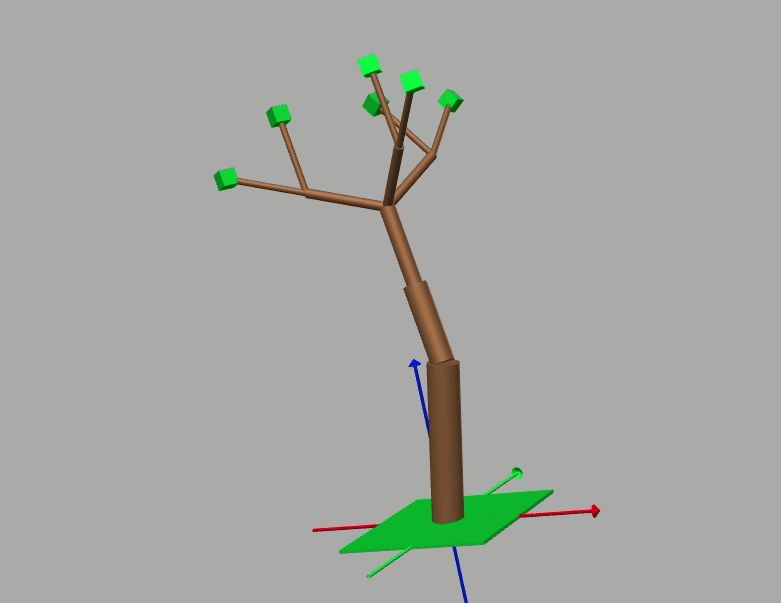
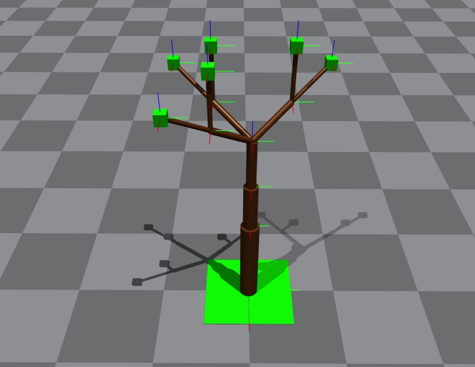

# *"Tree is All You Need"* : Predicting tree deformation using GNN

Mark Lee, Joe Huang, John Kim 

We provide PyTorch code for our 11-785 Introduction to Deep Learning course project.

Our goal for this project is to learn the complex physics model of trees. More specifically, we want to predict the deformation of trees when an external force is applied. Obtaining a more accurate model of tree is important for the robot, as it can lead to safer and more robust manipulation in agriculture. For this purpose, we use recent advancements in Graph Neural Networks and take advantage of graph-like tree structures to learn and predict the dynamics of tree deformation. We share our custom collected synthetic dataset as well as our codebase.

Paper: [TODO](arxiv_link)  
Video: [TODO](video_link)

<p align = "center">



</p>

--------------------------------------

### Prerequisites

This code is developed with Python3 (`python3`).   
It is recommended use [Anaconda](https://www.anaconda.com/products/individual) to set up the environment. Install the dependencies and activate the environment `tree-env` with
```bash
conda env create --file requirements.yaml python=3
conda activate tree-env
```

--------------------------------------
### Dataset
- #### Synthetic data 
    We collected a tree deformation dataset simulated in Isaac Gym, which can be found in the [Google Drive](https://drive.google.com/file/d/1YwUABOUg7ukxlmDqN1GojCtuJsZQ57J5/view?usp=sharing). For convenience, you can download them with the following script: (under this repo)
  ```bash
  gdown --id 1YwUABOUg7ukxlmDqN1GojCtuJsZQ57J5 # download tree_dataset.zip
  unzip tree_dataset.zip
  rm -f tree_dataset.zip
  mv tree_dataset data/tree_dataset
  ```
  The `data` directory should contain the subdirectory `tree_dataset`.

--------------------------------------

### Running the code

- #### Training:
  ```bash
  python main_train.py
  ```
- #### Testing:
  ```bash
  python main_test.py
  ```
- #### Generating GIF animations:
  ```bash
  python main_gif.py
  ```
  All the results will be stored in the directory `output/`.

--------------------------------------
### Code contributed and maintained by:
- John Kim: [chunghek@andrew.cmu.edu]()
- Joe Huang: [hungjuih@andrew.cmu.edu]()
- Mark Lee: [moonyoul@andrew.cmu.edu]()